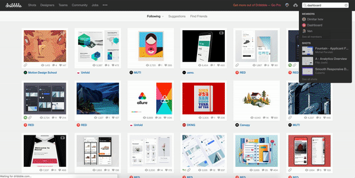
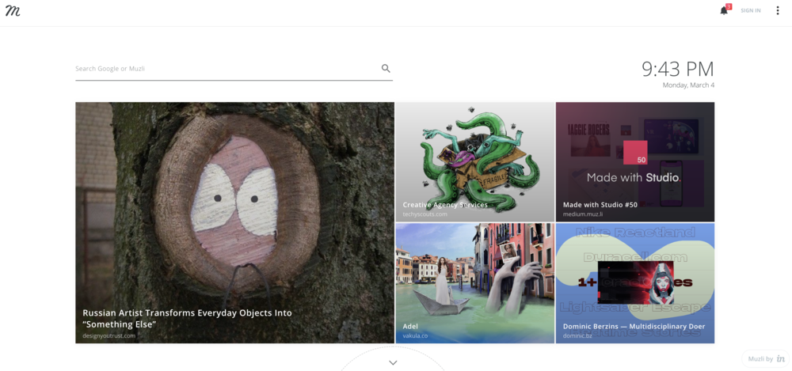
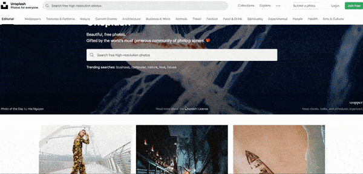
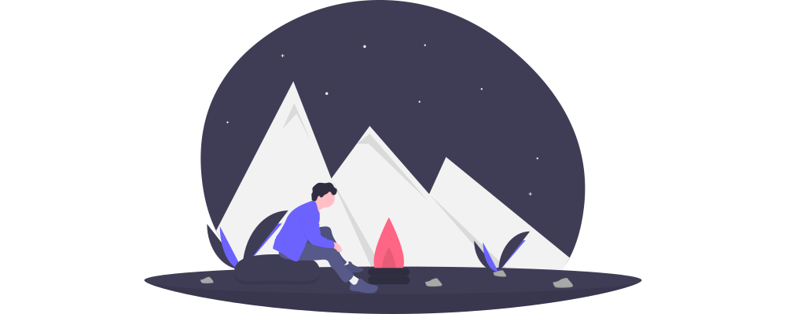
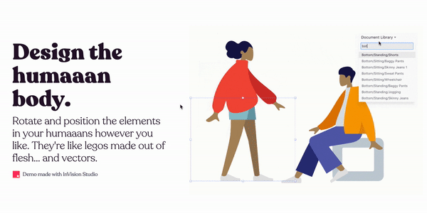
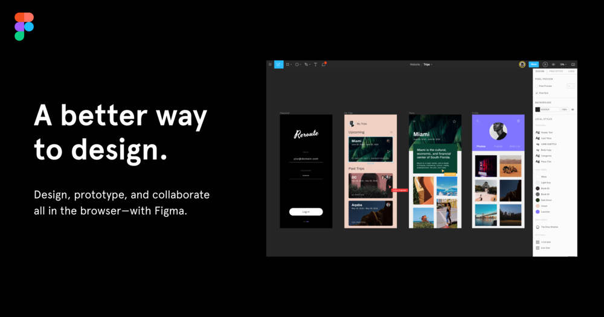

I remember the first web page I created. I spent some time doing it: it had a red maple tree as a background picture, and a wide range of pink shades. I was proud of it. When I think about it, it may be a good thing it was a personal project 🙈 (but who am I to judge)
As a fullstack freelancer now, I'm not sure the maple trees would work so well 🙃 To get a better understanding of what works in design/ UX and what doesn't, I had the great opportunity to learn at the PayFit rocket with super skilled designers, but I also worked on my own, thanks to this beautiful thing that is Internet.

## Inspiration

### [Dribbble](https://dribbble.com/)

If design were a religion, [Dribbble](https://dribbble.com/) would be my Bible. I find everything I need there, just using simple keywords. Recently, I had to design a Dashboard on my own for a customer: I just had to do some research, gather everything in my buckets, and my inspiration was there, ready to be used 🚀

There's also [Behance](https://www.behance.net/), but I definitely use Dribbble more often.

### [Muz.li](https://muz.li/)

I also get my daily doses of designing inspiration directly from my browser with Muzli. Everytime I open a new tab on Google Chrome, I get suggestions about trendy designs. There's always a cute [Codepen creation](https://codepen.io/), a beautiful portfolio, or crazy websites, like the recently released [Captain Marvel's promotion website](https://www.marvel.com/captainmarvel/).

Whenever I specifically have to design a landing page, or I'm looking for a specific theme (like the hightlights on my personal blog), I also take some time to check [Landbook's](https://land-book.com/) amazing landings.

## Resources

Having a beautiful website also requires beautiful visuals. To do so, it's essential for visuals to not have any copyright. Such resources are not that easy to find.

### [Unsplash](https://unsplash.com/)

Unsplash is a community of photographers who give their pictures for free, in exchange of some visibility. Most of the pictures there are amazing, and it's HD quality. I'm actually selling myself away, because that's where I got the illustration pictures of my blogs posts, but also my Linkedin and Twitter cover pictures ✨

### [Undraw](https://undraw.co)

Whenever I need a meaningful illustration to make a presentation or a webpage beautiful, I know I can count on [Undraw](https://undraw.co). Once again, I just need to look for the design I am looking for, and I can download it in the colour I need for my project, in an SVG format. Which means I can totally edit it according to my needs 🚀

There's also the [Humaaans](https://www.humaaans.com/)'s illustrations library, which is also pretty awesome (special bonu for the wheelchair designs).

Recently, I also heard about [Moose](https://photos.icons8.com/), that lets you create your own stock photos. I've never tried it yet, but I'm pretty sure it can be useful.

### Icons
I couldn't finish this section without talking about icons. Most of you probably know about it, but a quick reminder never hurt nobody 💁‍♀️
The two resources I use most often are [Flaticon](https://www.flaticon.com/) and [Noun Project](https://thenounproject.com/). Both platforms allow you to download icons in an SVG or PNG format, which is super useful. Even for people who don't do webdesigning, Icons are super useful. I remember doing a presentation in College, and my teacher was just in love with it, even though the content itself was quite bullshitty 🙈

## Tools

### [Figma](https://www.figma.com/files)

My post would be nothing without the tool I use all the time now. Let me introduce [Figma](https://www.figma.com/files). I talked about it in the post about [how I created my own website](https://alexiatoulmet.com/blog/the-come-back-of-personal-blogging/). Figma is quite an amazing tool: you can create designs online, edit it collaboratively, and entirely for free !
The way it works is quite similar to Sketch (which is also pretty awesome, but is not free). 

### Googled tools
Most of the time, I don't take the time to use the specific tools to do what I need. I have the great reflex to Google everything, and there's almost everytime an online tool for what I need. For example, to make the GIFs on this page, I used [Ezgif](https://ezgif.com/maker). But I also use online tools, to crop pictures, change the format of my files, etc. The only thing is I need to be careful about what files I upload because I would'nt want to give those platforms sensitive datas, such as my Id Card, or such things. But for most cases of my daily life, these online tools work perfectly 🚀

### What about you?
If you use other tools, don't hesitate to write to me on the email link below ⬇ or DM me on Twitter!