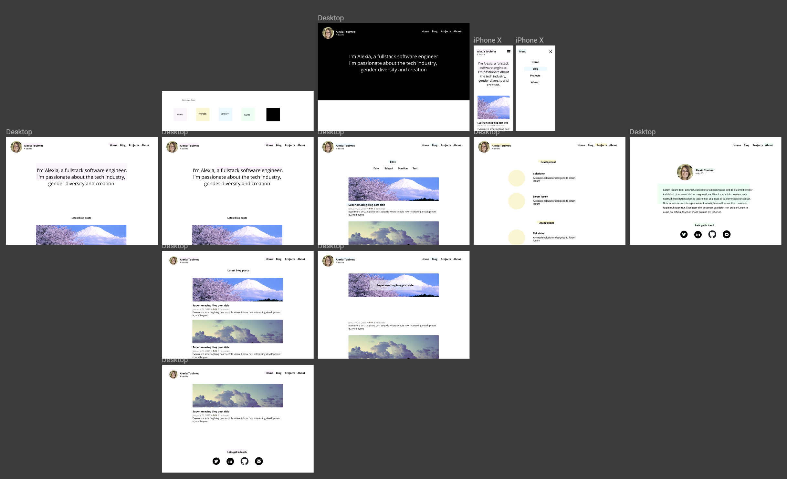

As I said in my previous post, the main goal was to have somewhere to share as thoughts as soon as I possible. The goal was not to wait 3 months before I was able to post my first post. So I decided to keep things simple on the technical side as well.
Here are the steps I took to have my personal website.
<h3>
    1- Design and specs
</h3>

When it comes to development, everything is so much easier when features have been thought through before starting coding. Even for personal projects, it's super important to keep that in mind. 
As it comes for features, I chose to make the most out of basic ones. With that in mind I defined the pages I wanted, I could always develop more features later.

I made a simple design on Figma.



Figma is a Sketch-like application, that lets you design you application for free.

<h3>
    2- Coding
</h3>

Many people around me are super hyped with GatsbyJS, and I already love coding in React / NodeJS. One of the advantages of Gatsby is it takes React code, and makes static pages from it, which makes your website really fast. Plus, the community around Gatsby is great, and I knew there was a great plugin that would allow me super easily to write pages in markdown that would be automatically converted in HTML. My choice was simple. 

I followed [Jean Elie's tutorial](https://jean-elie.com/blog/post/building-a-blog-with-gatsby/) who's my ex colleague at PayFit. Anyway, the documentation is really good. I also started from the gatsby-starter-blog and decided to add Styled Components. 

Google Analytics is already in the blog starter, so all you have to worry about is to set your ID in gatsby-config.js
```
    plugins: [
        {
            resolve: `gatsby-plugin-google-analytics`,
            options: {
            trackingId: `YOUR ID HERE`,
            },
        }
    ]
```

Another little useful modification is to add `gatsby-remark-external-links` to make sure the links you make in markdown create a new tab everytime you click them. 
To do so simply ```npm i gatsby-remark-external-links``` then add this in gatsby-config.js
```
        resolve: `gatsby-transformer-remark`,
        options: {
            plugins: [
                {
                    resolve: "gatsby-remark-external-links",
                    options: {
                        target: "_blank",
                        rel: "nofollow"
                    }
                }
            ]
        }
```

After a few days of coding, my website was ready for deployment.

<h3>
3- Deployment
</h3>

To deploy my website, I used to use Heroku, that is super easy. But it appeared, Now is even easier : once the CLI is installed, you just have to tap `now` in your terminal. It deploys it on a random url every time. The only thing left now is to link this url to your domain name.

I chose to buy my Domain Name on Google Domains, because I knew the user interface is quite simple to use. 

Once done, you just have to run ```now domains add YOUR DOMAIN``` in your terminal, then follow one of the two options that are given to you. 

For both options, on Google Domains, you can make the right settings in the DNS section.

You have all the details [here](https://zeit.co/docs/v2/domains-and-aliases/adding-a-domain/). Then you can make the alias like explained [here](https://zeit.co/docs/v2/domains-and-aliases/aliasing-a-deployment/)

And voilà !

Just one thing: don't forget to add an alias for both yourdomain.com and www.yourdomain.com
And you're set to go 

