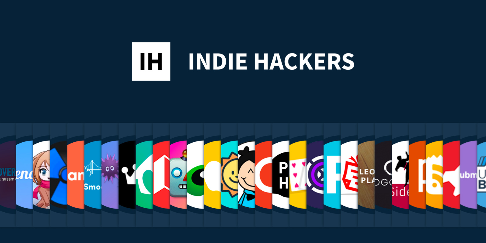
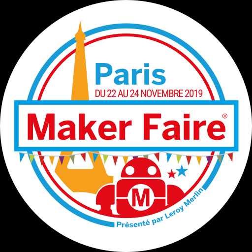

I heard about Indie Hackers for the first time from a colleague when I was working at [PayFit](https://payfit.com/). Jean Elie was a fullstack developer, and was spending all his spare time on side projects. I didn't know at the time but he was actually planning to quit to be 100% focused on his own products. I was also thinking about what I wanted to do with my life and projects that really mattered to me. Being a 9 to 5 employee was not fulfilling for me, so I started asking more and more questions to Jean Elie. He gave me the book [Start small, Stay small](https://www.amazon.fr/Start-Small-Stay-Developers-Launching/dp/0615373968) by Rob Walling, which opened an entirely new universe for me: the Indie Hackers world 🤩

### A goal, different communities

The concept of Indie Hacker can be hard to explain. To sum up, an Indie Hacker is someone with technical skills 🛠, most of the times a developer, who wants to create his or her own product in order to generate recurring revenue, seeking a goal of financial freedom. Indie Hackers definitely don't want to raise money because they value their independence more than anything, they don’t want a boss even though some of them are doing it on their personal time: they get their money from customers.

Several communities were built over time to gather those people, for them not to feel lonely in their quest for freedom. The most famous one is [Indie Hackers](https://www.indiehackers.com/), which was created by Courtland Allen about 3 years ago. He created a space where indie hackers “come together to share their experiences, give and receive feedback, and rely on each other for support”.

Apart from the official Indie Hackers’ website, there are tons of communities for people who are looking for this ideal. My friend Jean Elie first joined [Maker’s Kitchen](https://makerskitchen.xyz/) to get feedback on his work. I’ve also heard of [Women Make](https://womenmake.com/), and so many others... Twitter is your friend to find this kind of communities.

### A free maker mindset

One thing struck me really quickly when discovering this world: it sounded really similar to the [maker world](https://en.wikipedia.org/wiki/Maker_culture) I discovered a few years ago when I was working for [Sculpteo](https://www.sculpteo.com/). For those who don't know about it, the maker culture is a mix of tinkering and using digital tools, like 3d printing, laser cutting, [Arduino](https://www.arduino.cc/), [Raspberry Pi](https://www.raspberrypi.org/), etc. They have [fablabs](https://en.wikipedia.org/wiki/Fab_lab) and gather for different events like the Maker Faire (the next one in Paris will be in November!). The way I see it, Indie Hackers are to software what Makers are to hardware. Both use technology to find solutions to give life to their ideas. Personally I really feel attracted to both. Even when a maker doesn’t know how to use a technology, he or she will just master (online, ask people, etc) it to make it happen. Just do it 💪

Indie Hackers don’t only create things, they’re also pursuing an ideal of independence. In some interviews like this one I loved on [CodeNewbie](https://www.codenewbie.org/podcast/what-s-an-indiehacker), Courtland Allen calls it “an act of rebellion” against two things:

- Working a 9 to 5 job. For developers, it can be frustrating to trade your time for a salary to produce code for a company, code that will create a huge value for the company since it can be used over and over, even after the employee left.

- It also can be seen as a rebellion against the cult of startups who value growth and fundraising more than anything. For indie hackers, it’s a way to say “hey, let’s keep things at a human scale, we can still create a lot of value, and we don’t need to hire 10 new people every week, and raise millions every year”.

### One solution among others

Now that I know more about this movement, I totally understand why I felt so drawn to it. When I was an employee, even though I felt like I was paid enough, I knew I had tons of projects I wanted to make come true. I wanted to create my blog, get more involved in gender diversity in tech, create my own podcast, and other things, but it was not possible because I simply didn’t have enough time. All the money I could get was not worth the time I could not spend on my projects, and this is why I decided to quit and become a freelancer.

I feel like this kind of mindset is getting more and more common (hello dear millennials, the ones people love to complain about in LinkedIn posts 👋). I hear a lot about people quitting suddenly because they don’t find a purpose for what they are doing in their day to day life.

Personally, freelancing is the solution to the way I felt. Right now, I don’t feel like being 100% focused on one single adventure. I can change projects when I feel like doing something new, I can choose when I want to work and when I don’t: I feel more free. For example, I knew I wanted to teach things: I’m now splitting my business in half coding, half teaching.
Maybe you’ve heard of [Mangrove](https://www.facebook.com/meetmangrove/), the community that organized retreats abroad for freelancers who wanted a more fulfilling and balanced work life. They found their way. I know I’m not the only weirdo out there.

For now freelancing is my solution. Being an indie hacker is Jean Elie's and so many others’. I’m pretty sure I’ll give it a try at some point, but in the meantime, it's great to know some people are passionate enough to create new ways of working 🚀

---

### If you want to learn more about Indie Hackers:

- [Indie Hackers Website](https://www.indiehackers.com/)
- [Courtland Allen’s interview](<(https://www.codenewbie.org/podcast/what-s-an-indiehacker)>)
- [Start small, Stay small by Rob Walling](https://www.amazon.fr/Start-Small-Stay-Developers-Launching/dp/0615373968)

Some inspiring Indie Hackers:

- [Jean Elie](https://twitter.com/jebarjonet)
- [Alyssa X](https://twitter.com/alyssaxuu)
- [Aiden](https://twitter.com/Aidenbuis)
- [Anne-Laure Le Cunff](https://twitter.com/anthilemoon)
- [Adrien Joly](https://twitter.com/adrienjoly)

If you want to share some other ressources, don't hesite to [tweet it to me](https://twitter.com/atoulmet), or to shoot me an [email](mailto:alexia.toulmet@gmail.com)!
